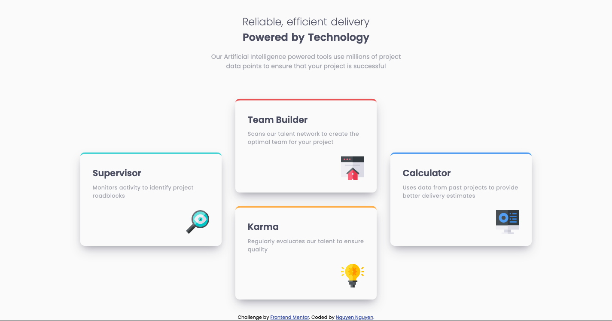

# Frontend Mentor - Four card feature section solution

This is a solution to the [Four card feature section challenge on Frontend Mentor](https://www.frontendmentor.io/challenges/four-card-feature-section-weK1eFYK). Frontend Mentor challenges help you improve your coding skills by building realistic projects.

## Table of contents

- [Overview](#overview)
  - [The challenge](#the-challenge)
  - [Screenshot](#screenshot)
  - [Links](#links)
- [My process](#my-process)

  - [Built with](#built-with)
  - [What I learned](#what-i-learned)

  - [Useful resources](#useful-resources)

- [Author](#author)
- [Acknowledgments](#acknowledgments)

## Overview

### The challenge

Users should be able to:

- View the optimal layout for the site depending on their device's screen size

### Screenshot



### Links

- Solution URL: [View code](https://github.com/jesuisbienbien/four-card-feature-section)
- Live Site URL: [View Live site](https://jesuisbienbien.github.io/four-card-feature-section/)

## My process

### Built with

- Semantic HTML5 markup
- CSS custom properties
- CSS Grid
- Mobile-first workflow

### What I learned

```css
.cards-container {
  grid-template-columns: repeat(3, 1fr);
  grid-template-areas:
    "supervisor team calculator"
    "supervisor  karma  calculator";
  gap: 2rem;
  justify-items: start;
  align-items: end;
  margin-top: 4rem;
}
```

### Useful resources

- [css-trick](https://css-tricks.com/grid-areas-element-occupies-arent-necessarily-size/) - This helps me learn how to prevent the element stretched in grid

## Author

- Github - [Nguyen Nguyen](https://github.com/jesuisbienbien)
- Frontend Mentor - [@jesuisbienbien](https://www.frontendmentor.io/profile/jesuisbienbien)

## Acknowledgments
